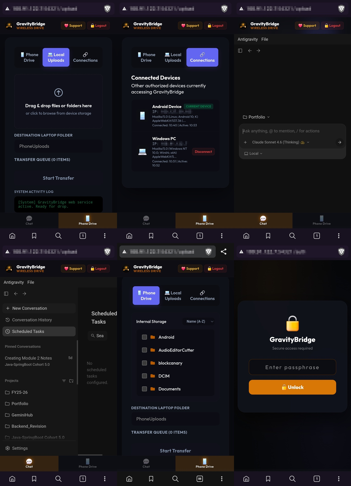

# GravityBridge: Symmetrical Mobile Portal for Antigravity 2.0

> **Run desktop AI agents directly from your phone while browsing and transferring phone storage, all in a unified mobile interface.**



---

## Why This Project Exists

Standard cloud-based AI chat interfaces (like Gemini Web or ChatGPT) are completely isolated from your local development environment. Antigravity 2.0 runs locally on your laptop, giving the AI agent full host capabilities: direct file read/write, AST-based codebase parsing, terminal command execution, and background task scheduling.

GravityBridge acts as a local reverse proxy that exposes this entire agentic environment securely to your phone's browser. By embedding the desktop Antigravity page inside a responsive overlay on top of an ADB-driven Phone Drive explorer, you gain simultaneous access to both your phone's storage and your laptop's AI workspace.

### Gemini Web vs. Antigravity 2.0 (via GravityBridge)

| Feature | Standard Gemini Web/App | Antigravity 2.0 + GravityBridge |
|---|---|---|
| **Local File Operations** | ❌ None (sandboxed file uploads only) |  Direct laptop workspace read/write & edits |
| **AST Codebase Analysis** | ❌ Limited context / single-file |  Deep repository analysis & Graphify AST parsing |
| **Command Line Execution** | ❌ No host terminal access |  Real-time shell command execution (git, tests, builds) |
| **Symmetrical Mobile Access** | ❌ Single isolated chat window |  Simultaneous phone storage & local PC agent access |
| **Agentic Automation** | ❌ One-off prompt responses |  Background task runner, timer & cron scheduling |
| **Data Privacy & Hosting** | ❌ Sent to cloud servers |  100% locally hosted (via Tailscale or Wi-Fi) |

---

## Core Motivational Workflows

* 🛋️ **Couch Coding**: Control code generation, verify git status, and run terminal tests directly from your phone browser on your couch.
* 📸 **Instant UI Debugging**: Snap a screenshot of a mobile layout bug, pull it to your laptop via ADB in one click, and let the agent fix styling bugs instantly.
* 📂 **Wireless File Hub**: Browse your phone's `/sdcard` in real-time, select files/directories with checkboxes, and pull them directly into local laptop drives.
* 🔄 **Symmetrical Multi-Tasking**: Monitor long-running agent tasks or shell logs in the chat panel while keeping your phone directory explorer fully active.

---

## Features at a Glance

| Feature | Description |
|---|---|
| Phone Drive Explorer | Browse phone's `/sdcard` in real-time via ADB Wi-Fi |
| Checkbox Selection | Tap to stage multiple folders/files before transfer |
| Local Drop Zone | Drag & drop files/folders from laptop browser |
| ZIP Auto-Extract | Drop a `.zip` and it extracts automatically on laptop |
| True Progress Tracking | Server-side byte tracking bypasses VPN buffering |
| Single-Item Retry | Retry individual failed transfers without re-uploading everything |
| Instant SPA Switching | Chat <-> Phone Drive toggles via hidden iframe overlay (<300ms) |
| Background Chat Preload | Chat loads silently after auth, instant when clicking Chat tab |
| Device Notifications | Toast alerts when a new device connects to the portal |
| Network Agnostic | Works on local Wi-Fi, Tailscale VPN, or cellular data |
| Chat Integration | Orange side-tab on Antigravity chat page for one-tap access |
| PIN Authentication | Lock screen protects all routes from unauthorized access |

---

## Prerequisites

| Requirement | Details |
|---|---|
| Python 3.10+ | `python --version` |
| Android Debug Bridge (ADB) | Download [Platform Tools](https://developer.android.com/tools/releases/platform-tools) |
| Tailscale (optional, for cross-network) | [tailscale.com](https://tailscale.com) |
| Android phone with Developer Options | ADB Wireless Debugging enabled |
| Antigravity desktop app | Running on the same laptop |

---

## Quick Start

### Step 1: Clone the repo

```powershell
git clone https://github.com/Arora-Sir/Gravity-Bridge.git
cd Gravity-Bridge
```

### Step 2: Environment Configuration

```powershell
cp .env.example .env
```

Open `.env` in any text editor and fill in your values:

```ini
# Your secret passphrase for the lock screen
AUTH_PIN=yourStrongPassphrase123

# Full path to your ADB executable (required for Phone Drive Explorer)
ADB_EXECUTABLE_PATH=C:\platform-tools\adb.exe

# Port the proxy listens on (optional, change if default conflicts)
PROXY_PORT=15842

# Your display name (used in AI system prompts)
USER_DISPLAY_NAME=YourName
```

All paths and personal identifiers are configured via `.env` (nothing is hardcoded).

### Step 3: Run the proxy

> [!IMPORTANT]
> **Antigravity 2.0 must already be running on your Windows machine before this step.** GravityBridge works by dynamically detecting the Antigravity local server port and forwarding all chat traffic through it. Without Antigravity running, the proxy will start but the Chat tab will not function. Keep Antigravity running at all times while using GravityBridge from your phone.

```powershell
python -u proxy.py
```

You should see:

```
[+] AUTH_PIN loaded from .env (20 chars)
[+] PROXY_PORT set to: 15842
====================================================
     GravityBridge 5.38: Dynamic HTTP Proxy
====================================================
[*] Searching for active port...
[+] Found active SSL port (200 OK): 65286
[+] Dynamic Routing Active -> Forwarding to https://127.0.0.1:65286
[+] Proxy listening on http://0.0.0.0:15842
====================================================
```

### Step 4: Open from your phone

On the **same Wi-Fi**, find your laptop's local IP:

```powershell
ipconfig | Select-String "IPv4"
```

Then open in your phone browser:

```
http://YOUR_LAPTOP_IP:15842/upload
```

Example: `http://192.168.1.100:15842/upload`

---

## Network Setup Options

### Option A: Same Wi-Fi (Simplest)

Both devices must be on the same router. Use your laptop's local IP (`192.168.x.x`).

### Option B: Tailscale (Recommended for cross-network)

1. Install Tailscale on both laptop and phone: [tailscale.com/download](https://tailscale.com/download)
2. Sign in with the **same account** on both devices
3. On phone, open Tailscale. Your laptop will appear with a `100.x.x.x` IP
4. Open in phone browser: `http://100.x.x.x:15842/upload`

> Tailscale creates a secure WireGuard mesh that works anywhere, even on mobile data.

---

## ADB Wireless Debugging Setup

> Required for the **Phone Drive Explorer** (browsing phone storage and checkbox pulls).

### Samsung / Stock Android

1. Go to **Settings -> About Phone -> Software Info**
2. Tap **Build Number** 7 times to unlock Developer Options
3. Go to **Settings -> Developer Options -> Wireless Debugging**
4. Enable it and note the device IP (same as your phone's Wi-Fi IP)
5. Run on laptop:

```powershell
adb connect YOUR_PHONE_IP:5555
adb devices
```

Expected output:
```
connected to 192.168.1.200:5555
List of devices attached
192.168.1.200:5555    device
```

### Using Shizuku (if Wireless Debugging is unavailable)

1. Install [Shizuku](https://play.google.com/store/apps/details?id=moe.shizuku.privileged.api) from Play Store
2. Enable ADB via Shizuku (requires one-time USB setup)
3. ADB stays authorized persistently without re-approving on reboot

---

## Directory Structure

```
Gravity-Bridge/
├── proxy.py              # Main proxy server (all logic in one file)
├── server.py             # AI agent backend server
├── requirements.txt      # Python dependencies
├── .env.example          # Environment template (copy to .env)
├── DeviceUploads/        # All transferred files land here (auto-created)
│   └── PhoneUploads/     # Default subfolder for phone transfers
├── static/               # Frontend assets (served by server.py)
└── README.md
```

> **Note:** `DeviceUploads/` is auto-created on first upload. It is `.gitignore`-d by default.

---

## Configuration Reference

All configuration is handled via the `.env` file (see `.env.example` for the template):

| Variable | Required | Description |
|---|---|---|
| `AUTH_PIN` | Yes | Passphrase for the web portal lock screen |
| `ADB_EXECUTABLE_PATH` | For Phone Drive | Full path to `adb.exe` (e.g. `C:\platform-tools\adb.exe`) |
| `PROXY_PORT` | No | Port the proxy listens on (default: `15842`) |
| `USER_DISPLAY_NAME` | No | Name used in AI system prompts (defaults to Windows username) |
| `USER_HOME_PATH` | No | Home directory for file operations (defaults to `~`) |

The proxy auto-detects phone IP and conversation paths at runtime, so no manual configuration is needed.

---

## Available Routes

| Route | Method | Description |
|---|---|---|
| `/auth` | GET | Lock screen (PIN entry page) |
| `/auth` | POST | Validates PIN, issues session cookie, redirects to `/upload` |
| `/auth/sessions` | GET | Returns JSON list of active sessions (used for device monitoring) |
| `/auth/logout` | POST | Invalidates current session |
| `/auth/dashboard` | GET | Security dashboard showing sessions, blocked IPs, event log |
| `/upload` | GET | Serves the full Phone Drive portal HTML |
| `/upload` | POST | Receives file bytes, writes to `DeviceUploads/` |
| `/upload-progress` | GET | Returns `{received, total}` bytes for true progress |
| `/adb-ls` | GET | Lists phone directory contents via ADB |
| `/adb-pull` | POST | Pulls a specific phone path to laptop via ADB |
| `/adb-pull-auto` | POST | Auto-searches phone for a folder by name and pulls it |
| `/` | GET | Redirects to active Antigravity conversation |

---

## Security

> [!WARNING]
> GravityBridge exposes powerful local capabilities (local read/write file access, shell command execution, and Electron debugger control). It is strictly designed for **private, local development**. Never expose this port to the public internet, use a weak lock-screen PIN, or run the server on untrusted public Wi-Fi networks without active Tailscale WireGuard encryption.

GravityBridge uses a **PIN-based lock screen** to protect all routes from unauthorized access.

### What is Protected

When you first open the portal, you are greeted with a lock screen. You must enter the correct `AUTH_PIN` (configured in `.env`) to gain access. Once authenticated:

- A secure session token (cookie) is issued, valid until browser close or manual logout
- All protected routes (`/upload`, `/adb-ls`, `/adb-pull`, `/adb-pull-auto`) require a valid session
- The PIN is never stored in plaintext; only a SHA-256 hash is kept in memory

### Brute Force Protection

Failed login attempts are tracked per IP address:

- After 5 failed attempts within 10 minutes, the IP is temporarily blocked
- A simple math captcha is required to unblock (prevents automated attacks)
- PIN comparison uses constant-time comparison to prevent timing attacks

### Current Mitigations (Built-in)

- **PIN authentication:** all routes require a valid session token
- **File path sanitization:** upload paths strip `..` sequences to prevent directory traversal
- **ADB path is configurable:** the ADB binary path is set via `.env`; no user-supplied binary execution
- **ZIP extraction path validation:** each zip entry's path is validated before extraction
- **Session management:** tokens invalidate on logout or browser close
- **Constant-time PIN compare:** prevents timing side-channel attacks

### Known Risks

Even with authentication, be aware of the following:

| Risk | Severity | Note |
|---|---|---|
| HTTP (not HTTPS) | Medium | Data is not encrypted in transit. Use Tailscale's WireGuard for encryption |
| Open Wi-Fi sniffing | Medium | Without Tailscale, session cookies could be sniffed on public Wi-Fi |
| Disk exhaustion | Medium | Consider adding a file size limit in production use |
| ZIP path traversal | Low | Path sanitization is in place, but always keep GravityBridge updated |

### Real-World Attack Scenarios

#### Scenario 1: Someone on your local Wi-Fi without the PIN
They try to open `http://your-ip:15842/upload`. They see the lock screen and cannot proceed without the correct `AUTH_PIN`. **They need the PIN to get past the lock screen.**

**Note:** If you are on a public network, the lock screen page itself is served over HTTP and visible. Use Tailscale to prevent anyone from even reaching the lock screen.

#### Scenario 2: Brute force attempts
An attacker repeatedly tries different PINs. After 5 failed attempts, their IP gets blocked and they must solve a captcha. This makes automated brute-forcing impractical.

**Mitigation:** Use a strong, long passphrase for `AUTH_PIN`.

#### Scenario 3: Tailscale IP shared accidentally
You screenshot your Tailscale dashboard and your `100.x.x.x` IP is visible. Someone outside your tailnet tries `http://100.x.x.x:15842`. Tailscale won't route it.

**Mitigation:** Never enable Tailscale subnet routing for the device running GravityBridge.

#### Scenario 4: Session cookie sniffing on open local networks (unencrypted HTTP)
An attacker on the same local Wi-Fi captures your network packets, extracts the unencrypted `session` cookie, and uses it to clone your authenticated browser session.

**Mitigation:** Only run the proxy on trusted networks, or use Tailscale (which creates an encrypted WireGuard tunnel, making packet sniffing impossible).

#### Scenario 5: Chrome DevTools Protocol (CDP) execution (Remote Code Execution)
An attacker manages to hijack your session (via sniffing or a weak PIN) and targets the `/` route which proxies requests to the Electron debugger port on localhost. They send commands to write local files or run system terminals.

**Mitigation:** Always configure a strong, unique `AUTH_PIN` passphrase (12+ characters) in `.env` to prevent brute force, and turn off the proxy process when not in use.

#### Scenario 6: ADB Wireless Debugging port scanning
An attacker on your local network runs a port scan, finds the phone's open ADB Wireless Debugging port (`5555`), and attempts to run `adb connect` to bypass the proxy entirely.

**Mitigation:** Android has built-in connection guarding. **Always reject** any unexpected authorization popup prompts on your phone.

### Recommended Security Practices

```
Priority 1 (MUST DO)
  Use a strong AUTH_PIN (12+ characters recommended)
  Use Tailscale for cross-network access (provides WireGuard encryption)
  Stop the proxy when done: Get-Process python | Stop-Process -Force

Priority 2 (SHOULD DO)
  Bind only to Tailscale IP instead of 0.0.0.0 (see hardened mode below)
  Add firewall rule blocking port 15842 from non-Tailscale interfaces
  Log out (or close browser) after each session

Priority 3 (NICE TO HAVE)
  Enable Tailscale ACLs to whitelist only specific devices
  Add upload size limit
  Enable connection logging dashboard to monitor who connects
```

### Binding only to Tailscale IP (hardened mode)

Find your Tailscale IP:
```powershell
tailscale ip -4
# Output: 100.100.100.100 (example)
```

Then in `proxy.py`:
```python
LISTEN_HOST = "100.100.100.100"  # Only reachable via Tailscale, not local Wi-Fi
```

This means the portal is **only accessible from within your Tailscale network**, with zero exposure on local Wi-Fi, public internet, or hotspots.

### What This Tool is NOT

- Not a production-grade server; it is a personal utility tool
- Not safe to expose on a public IP without HTTPS/Tailscale
- Not encrypted at the transport layer (HTTP, not HTTPS); use Tailscale's WireGuard for encryption
- Not designed for multi-user environments

---

## Troubleshooting

### Phone can't reach the portal

```powershell
# Check firewall allows port 15842
netsh advfirewall firewall add rule name="GravityBridge" dir=in action=allow protocol=TCP localport=15842
```

### ADB device not found

```powershell
# Reconnect ADB
adb kill-server
adb start-server
adb connect YOUR_PHONE_IP:5555
```

### Progress bar stuck at 20%

This is normal when uploading over Tailscale/cellular. The proxy is tracking actual bytes written to disk, and the progress will update as data arrives.

### Multiple Python processes running

```powershell
# Kill all proxy instances
Get-Process python | Stop-Process -Force
# Then restart
python -u proxy.py
```

### Proxy fails to start with "port must be 0-65535"

The `PROXY_PORT` in your `.env` is above `65535` (the maximum valid port). Set a value between `1024` and `65535`. The proxy will fall back to `15842` if an invalid port is detected and log a warning.

---

## License

This project is licensed under the [MIT License](LICENSE).

Copyright (c) 2025 Mohit Arora

---
