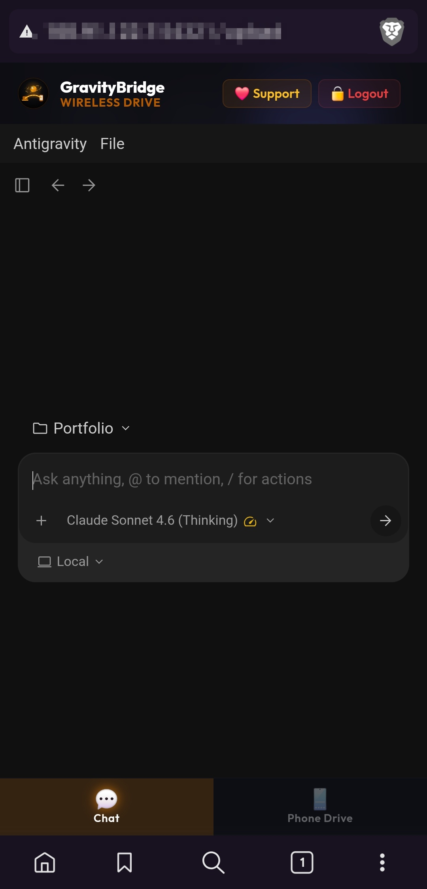
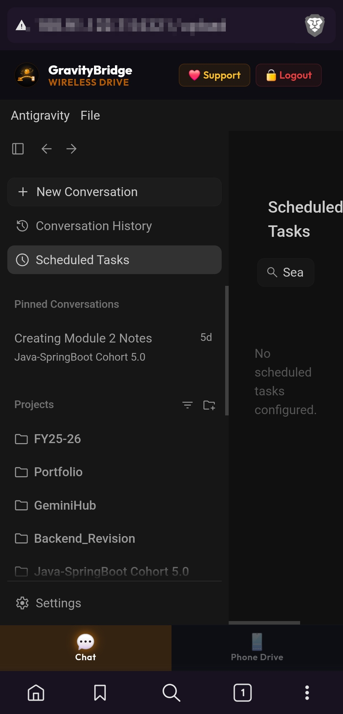
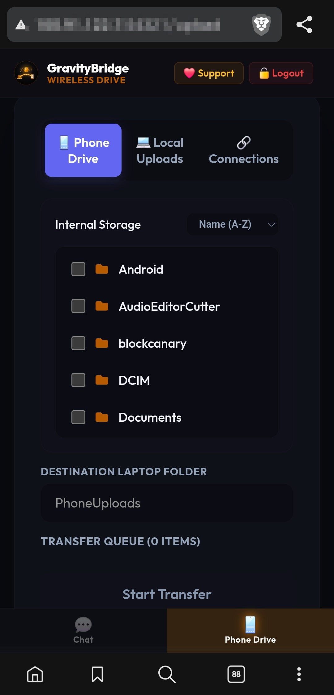
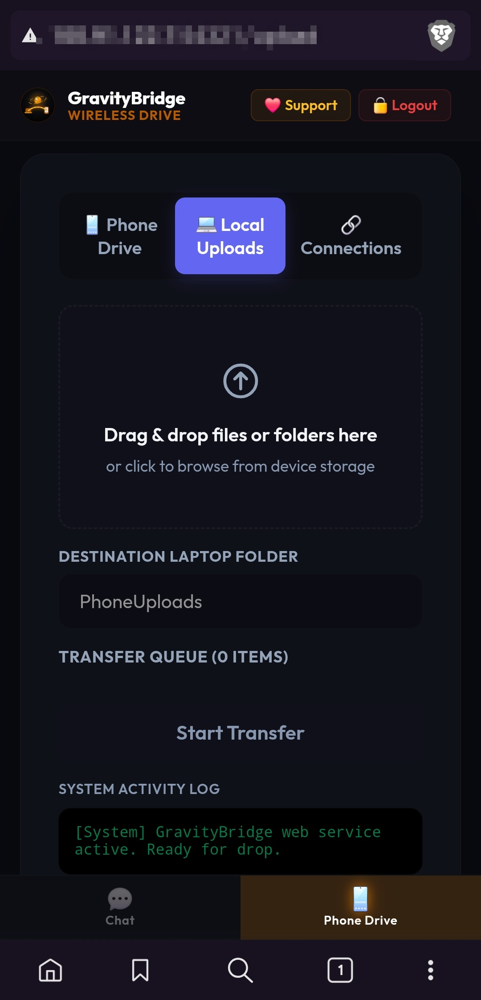
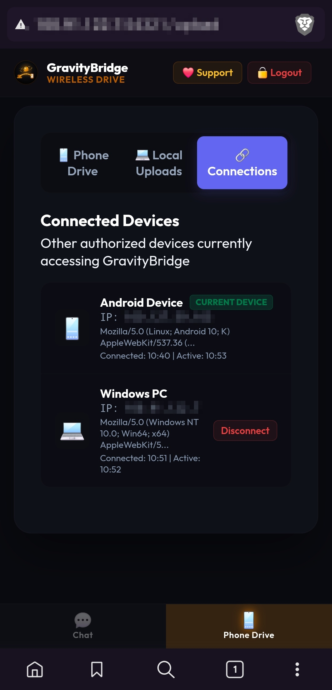
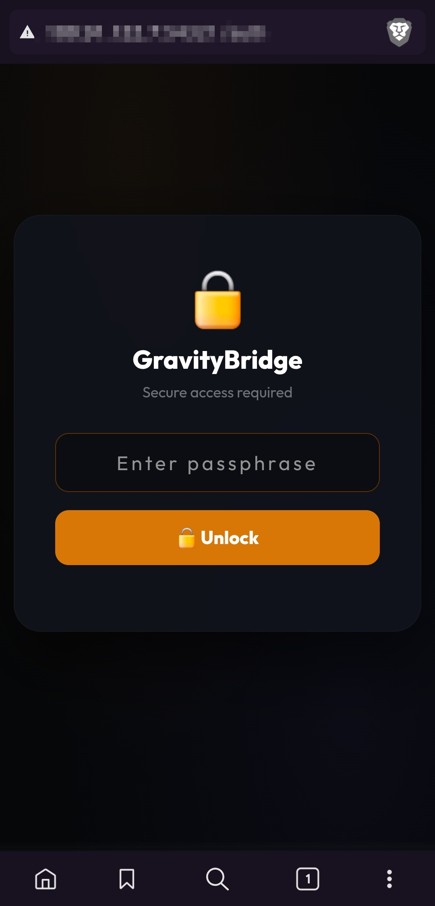

# GravityBridge: Mobile Portal for Google's Antigravity 2.0

> **Use your phone browser to control the AI coding agent on your PC, and transfer files between phone and laptop easily.**

[](https://www.python.org/)
[](https://deepmind.google/)
[](LICENSE)
[](https://www.microsoft.com/)
[](https://github.com/Arora-Sir/Gravity-Bridge)

---

## 🗺️ Quick Navigation

| [📖 Overview](#what-is-googles-antigravity-20) | [🖼️ Screenshots](#screenshots) | [🏗️ Architecture](#how-it-works-architecture) | [🛋️ Couch Coding](#real-example-coding-from-your-bed-or-couch) |
| :---: | :---: | :---: | :---: |
| [🚀 Quick Start](#quick-start) | [🔌 ADB Pairing](#adb-wireless-debugging-setup) | [🔒 Security](#security) | [🛠️ Troubleshooting](#troubleshooting) |

---

## What is Google's Antigravity 2.0?

**Antigravity 2.0** is a local AI coding assistant made by Google DeepMind. It runs directly on your computer (not in the cloud). It has full access to your laptop, so it can read and write files, scan your code structure, run terminal commands, and schedule background tasks.

But because it runs locally, you can only open it on your laptop (at `localhost`). Your phone browser cannot reach it by default.

**GravityBridge is a secure local proxy tool. It lets you open a web page on your phone browser to connect to the AI agent on your laptop. Now you can write code and control your workspace from your phone.**

---

## Symmetrical Features (PC and Phone)

GravityBridge puts the AI chat and a phone file explorer together in one single page on your mobile browser:

* 🛋️ **Couch Coding**: Write code, run tests, and check git commits from your phone while sitting on the couch.
* 📸 **Quick Mobile UI Debugging**: Take a screenshot of a bug on your phone, pull it to your laptop via ADB in one tap, and ask the AI agent to fix the stylesheet immediately.
* 📂 **Wireless Phone Drive**: Browse your phone `/sdcard` folders, select files with checkboxes, and copy them directly to your PC.
* 🔄 **Easy Multi-Tasking**: Watch the AI agent running tasks in the chat window, and browse your phone storage files at the same time.

---

## Screenshots

*Note: All private IP addresses in these screenshots are blurred for safety.*

| Feature & Description | Screenshot Preview |
|---|---|
| **💬 Antigravity Chat**<br><br>Control Google's Antigravity 2.0 AI agent on your laptop directly from your phone browser.<br><br>Run shell commands, edit files, and check git status via chat. |  |
| **📋 Sidebar & Task Management**<br><br>Slide out the sidebar menu to view your active workspace projects, check conversation logs, or manage background agent tasks. |  |
| **📂 Phone Drive Explorer**<br><br>Browse your Android device's `/sdcard` storage in real-time.<br><br>Select folders or files with checkboxes and wirelessly pull them to your PC in one tap. |  |
| **📥 Drag and Drop Upload Zone**<br><br>Upload files or directories directly from your PC browser and save them in the `DeviceUploads/` folder on your laptop.<br><br>Supports automatic extraction of uploaded `.zip` archives. |  |
| **🔗 Connected Devices Log**<br><br>Keep track of all active client sessions (both phone and PC) connected to the proxy, including browser details and connection time. |  |
| **🔐 Lock Screen**<br><br>The entry page to the portal. Enter the `AUTH_PIN` configured in your `.env` file to unlock the session.<br><br>Includes brute-force protection (CAPTCHA and temporary IP block after 5 failed attempts). |  |

## How it works (Architecture)

GravityBridge runs a Python web server on port `15842`. It connects your phone browser to the ADB tool and the Antigravity local server:

```
┌─────────────────────┐     HTTP (Wi-Fi / Tailscale)    ┌──────────────────────────────────┐
│    Phone Browser    │ ──────────────────────────────► │  GravityBridge Proxy  :15842     │
│  (Chrome / Brave)   │                                 │                                  │
└─────────────────────┘                                 │  ┌─────────────────────────────┐ │
                                                        │  │  /upload  → Phone Drive UI  │ │
                                                        │  │  /adb-ls  → Browse Android  │ │
                                                        │  │  /adb-pull → Pull files     │ │
                                                        │  │  /*       → Proxy to AI     │ │
                                                        │  └──────────┬──────────────────┘ │
                                                        └─────────────│────────────────────┘
                                                                      │ HTTPS localhost
                                                                      ▼
                                                        ┌─────────────────────────────────┐
                                                        │  Google Antigravity 2.0 :65286  │
                                                        │  (Electron app on your laptop)  │
                                                        └─────────────────────────────────┘
```

1. **Proxy Server**: It automatically finds the SSL port of the Antigravity desktop app on your laptop and forwards all chat traffic to it.
2. **Phone Drive API**: It uses standard Android Debug Bridge (ADB) commands to communicate with your phone storage.
3. **Single Page Web App**: Serves a fast dashboard page to switch between Chat and Phone Drive tabs quickly (less than 300ms).

---

## Real Example: Coding from your Bed or Couch

**Before this tool:**
You are relaxing on the couch. You think of a bug fix or want to see if your tests finished running. You have to get up, go to your desk, open your laptop, and type.

**With this tool:**
1. Open Brave or Chrome on your phone and go to your laptop IP (`http://192.168.1.100:15842`).
2. Log in with your PIN.
3. Tap **Chat** to load your Antigravity 2.0 workspace.
4. Type: *"Run git status and tell me if the tests passed."* The agent runs the shell commands and replies in real-time.
5. If you need to upload a screenshot of a bug, tap **Phone Drive**, select the photo, and tap **Pull to PC**. Done.

---

## Comparison Tables

### 1. Antigravity 2.0 vs. Cloud AI (Gemini Web or ChatGPT)

| Feature | Standard Gemini Web/App | Antigravity 2.0 |
|---|---|---|
| **System Control** | ❌ None (only sandboxed chat) | Direct file system access, run local terminal commands |
| **Codebase Parsing** | ❌ Manual file uploads | Auto AST-based analysis of the whole folder |
| **Automation** | ❌ Prompt and reply only | Run background tasks, timers, and cron schedules |
| **Privacy & Hosting** | ❌ Sent to cloud servers | Runs 100% locally on your laptop |

### 2. GravityBridge vs. Vanilla Antigravity

| Feature | Antigravity 2.0 alone | Antigravity 2.0 + GravityBridge |
|---|---|---|
| **Mobile Access** | ❌ Only works on your laptop screen | Accessible from any phone browser |
| **Wireless Transfers** | ❌ Needs USB cable or cloud drives | Built-in ADB-over-Wi-Fi Phone Drive explorer |
| **Lock Screen Auth** | ❌ None | Secure PIN login with rate-limiting protection |

---

## Features list

| Feature | Description |
|---|---|
| **Phone Drive Explorer** | Browse phone `/sdcard` in real-time via ADB Wi-Fi |
| **Checkbox Selection** | Choose multiple files or folders before copying |
| **Local Drop Zone** | Drag and drop files or folders from laptop browser |
| **ZIP Auto-Extract** | Drop a `.zip` file on your laptop, and it extracts automatically |
| **True Progress Tracking** | Server-side progress bar reporting (bypasses VPN buffering) |
| **Single-Item Retry** | Retry individual failed transfers without re-uploading everything |
| **Instant SPA Switching** | Switch between Chat and Phone Drive tabs quickly (under 300ms) |
| **Background Preload** | Chat tab loads in background after login, so it opens instantly |
| **Toast Alerts** | Popups on phone screen when a new device connects to the server |
| **PIN Security** | Lock screen protects all pages and API routes |
| **Brute Force CAPTCHA** | Blocks an IP after 5 failed PIN attempts, captcha required to unlock |

---

## Prerequisites

| Requirement | Details |
|---|---|
| Python 3.10+ | Check version: `python --version` |
| Android Debug Bridge (ADB) | Download [Platform Tools](https://developer.android.com/tools/releases/platform-tools) |
| Tailscale (optional) | Recommended for secure cross-network access: [tailscale.com](https://tailscale.com) |
| Android Phone | Wireless Debugging enabled in Developer Options |
| Antigravity Desktop App | Running on the same laptop |

---

## Quick Start

### Step 1: Clone the Repository

```powershell
git clone https://github.com/Arora-Sir/Gravity-Bridge.git
cd Gravity-Bridge
```

### Step 2: Environment Setup

```powershell
cp .env.example .env
```

Open `.env` in any text editor and fill in your values:

```ini
# Your secret passphrase for the lock screen
AUTH_PIN=yourStrongPassphrase123

# Full path to your ADB executable (required for Phone Drive Explorer)
ADB_EXECUTABLE_PATH=C:\platform-tools\adb.exe

# Port the proxy listens on (optional, change if default conflicts)
PROXY_PORT=15842

# Your display name (used in AI system prompts)
USER_DISPLAY_NAME=YourName
```

### Step 3: Run the Proxy Server

> [!IMPORTANT]
> **Antigravity 2.0 must already be running on your Windows laptop before this step.** GravityBridge works by finding the Antigravity local server port and forwarding all chat traffic to it. Without Antigravity running, the Chat tab will not work.

```powershell
python -u proxy.py
```

You should see output similar to:
```
[+] AUTH_PIN loaded from .env (20 chars)
[+] PROXY_PORT set to: 15842
====================================================
     GravityBridge 5.38: Dynamic HTTP Proxy
====================================================
[*] Searching for active port...
[+] Found active SSL port (200 OK): 65286
[+] Dynamic Routing Active -> Forwarding to https://127.0.0.1:65286
[+] Proxy listening on http://0.0.0.0:15842
====================================================
```

### Step 4: Open on Your Phone

Make sure your phone is on the **same Wi-Fi** network, and find your laptop IP:

```powershell
ipconfig | Select-String "IPv4"
```

Then open this URL in your phone browser:
```
http://YOUR_LAPTOP_IP:15842/upload
```
*(Example: `http://192.168.1.100:15842/upload`)*

---

## Network Setup Options

### Option A: Same Wi-Fi (Simplest)
Both devices must be connected to the same local router. Open the site using your laptop local IP (`192.168.x.x`).

### Option B: Tailscale (Recommended for Secure Cross-Network Access)
1. Install Tailscale on both laptop and phone: [tailscale.com/download](https://tailscale.com/download)
2. Sign in with the **same account** on both devices.
3. Turn on Tailscale on your phone. Your laptop will appear with a private `100.x.x.x` IP.
4. Open on your phone browser: `http://100.x.x.x:15842/upload` (works over mobile data too).

---

## ADB Wireless Debugging Setup

> Required for the **Phone Drive Explorer** to list files and pull storage.

### Standard Android and Samsung Setup
1. Go to **Settings -> About Phone -> Software Info**.
2. Tap **Build Number** 7 times to unlock Developer Options.
3. Go to **Settings -> Developer Options -> Wireless Debugging** and turn it on.
4. Note your phone IP and port, and run on your laptop:
```powershell
adb connect YOUR_PHONE_IP:5555
adb devices
```
Expected output:
```
connected to 192.168.1.200:5555
List of devices attached
192.168.1.200:5555    device
```

### Using Shizuku (Persistent ADB authorization)
1. Install [Shizuku](https://play.google.com/store/apps/details?id=moe.shizuku.privileged.api) from the Play Store.
2. Enable ADB via Shizuku (requires one-time USB setup).
3. ADB will stay persistently authorized without requiring re-approval prompts on phone reboots.

---

## Directory Structure

```
Gravity-Bridge/
├── proxy.py              # Main proxy server (all logic in one file)
├── server.py             # AI agent backend server
├── requirements.txt      # Python dependencies
├── .env.example          # Environment template (copy to .env)
├── DeviceUploads/        # All transferred files land here (auto-created)
│   └── PhoneUploads/     # Default subfolder for phone transfers
├── static/               # HTML and CSS assets (served by server.py)
└── README.md
```

---

## Configuration Reference

All configuration is handled via the `.env` file:

| Variable | Required | Description |
|---|---|---|
| `AUTH_PIN` | Yes | Passphrase for the web portal lock screen |
| `ADB_EXECUTABLE_PATH` | For Phone Drive | Full path to `adb.exe` (e.g. `C:\platform-tools\adb.exe`) |
| `PROXY_PORT` | No | Port the proxy listens on (default: `15842`) |
| `USER_DISPLAY_NAME` | No | Name used in AI system prompts (defaults to Windows username) |
| `USER_HOME_PATH` | No | Home directory for file operations (defaults to `~`) |

---

## Available Routes

| Route | Method | Description |
|---|---|---|
| `/auth` | GET | Lock screen (PIN entry page) |
| `/auth` | POST | Validates PIN, issues session cookie, redirects to `/upload` |
| `/auth/sessions` | GET | Returns JSON list of active sessions |
| `/auth/logout` | POST | Log out of current session |
| `/auth/dashboard` | GET | Security dashboard showing sessions, blocked IPs, event log |
| `/upload` | GET | Serves the full Phone Drive portal HTML |
| `/upload` | POST | Receives file bytes, writes to `DeviceUploads/` |
| `/upload-progress` | GET | Returns `{received, total}` bytes for true progress |
| `/adb-ls` | GET | Lists phone directory contents via ADB |
| `/adb-pull` | POST | Pulls a specific phone path to laptop via ADB |
| `/adb-pull-auto` | POST | Auto-searches phone for a folder by name and pulls it |
| `/` | GET | Redirects to active Antigravity conversation |

---

## Security

> [!WARNING]
> GravityBridge exposes powerful local laptop capabilities (file writes, shell command execution, and debugger access). It is designed for **private, local development**. Never expose this port to the public internet, use a weak lock-screen PIN, or run the server on untrusted public Wi-Fi networks without active Tailscale WireGuard encryption.

### Security Mitigations
* **PIN Authentication**: Lock screen protecting all critical pages and APIs.
* **File Path Sanitization**: Path inputs strip `..` sequences to prevent directory traversal.
* **Brute Force Defense**: Rate-limiting blocks an IP for 10 minutes after 5 failed PIN attempts, CAPTCHA required to unlock.
* **Constant-Time Verification**: Prevents timing side-channel attacks during PIN validation.
* **Safe ZIP Extraction**: Validates path bounds before extracting any ZIP entries.

### Hardened Mode: Bind to Tailscale Only
To prevent anyone on your local physical Wi-Fi network from reaching the lock screen, query your Tailscale IP:
```powershell
tailscale ip -4
# Example Output: 100.100.100.100
```
Then, update `LISTEN_HOST` in `proxy.py`:
```python
LISTEN_HOST = "100.100.100.100"  # Only reachable inside your Tailscale mesh
```

---

## Troubleshooting

### Phone cannot reach the web portal
Ensure your Windows Firewall is allowing incoming traffic on the proxy port:
```powershell
netsh advfirewall firewall add rule name="GravityBridge" dir=in action=allow protocol=TCP localport=15842
```

### ADB device not found
If the Phone Drive explorer reports an error connecting to the phone:
```powershell
adb kill-server
adb start-server
adb connect YOUR_PHONE_IP:5555
```

### Multiple Python instances running
To completely kill any hanging background proxy instances before starting:
```powershell
Get-Process python | Stop-Process -Force
python -u proxy.py
```

---

## License

This project is licensed under the [MIT License](LICENSE).

Copyright (c) 2026 Mohit Arora
